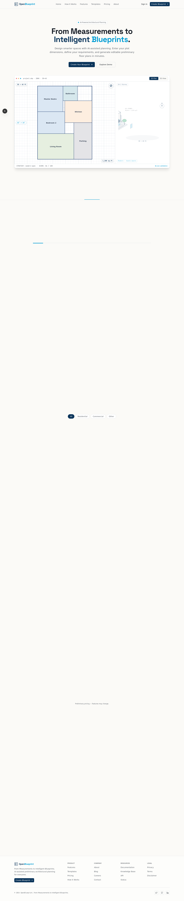
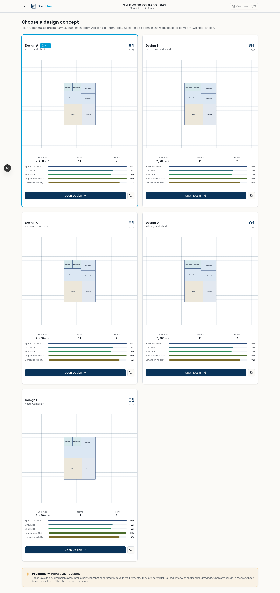
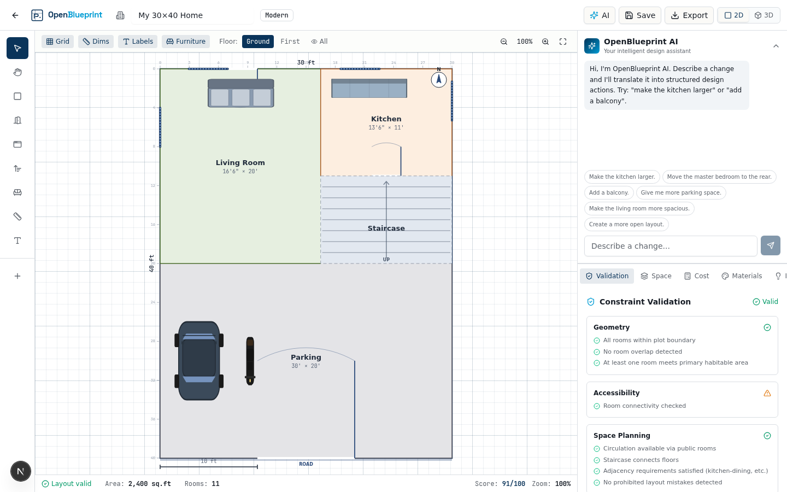
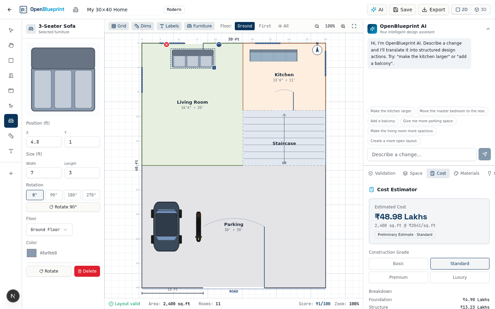
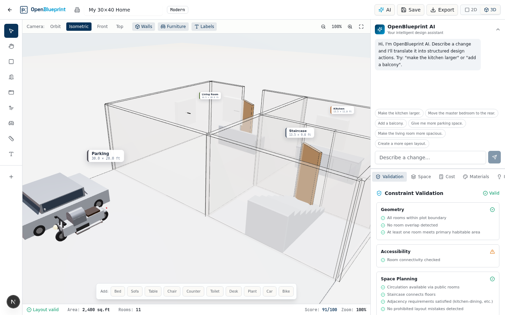
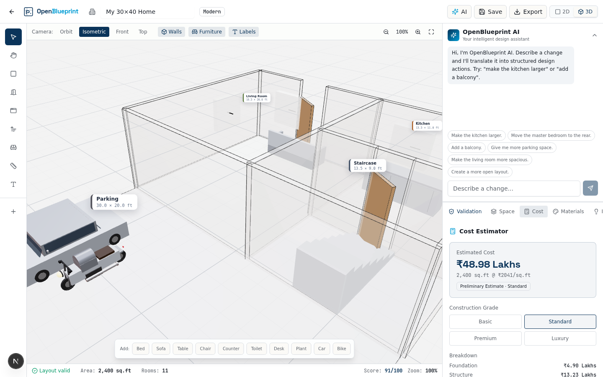
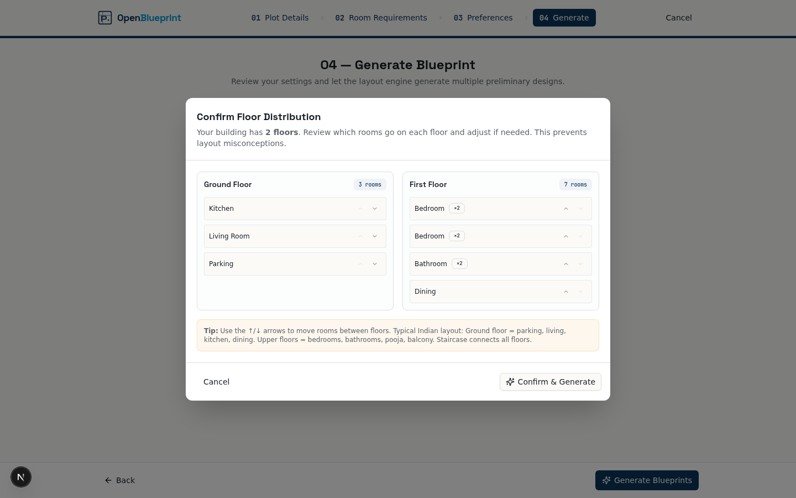
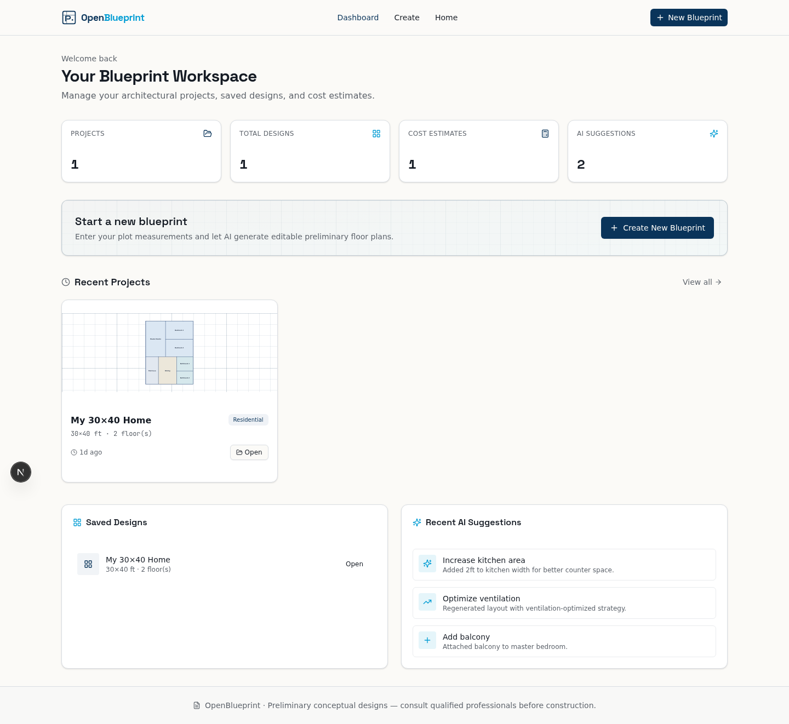
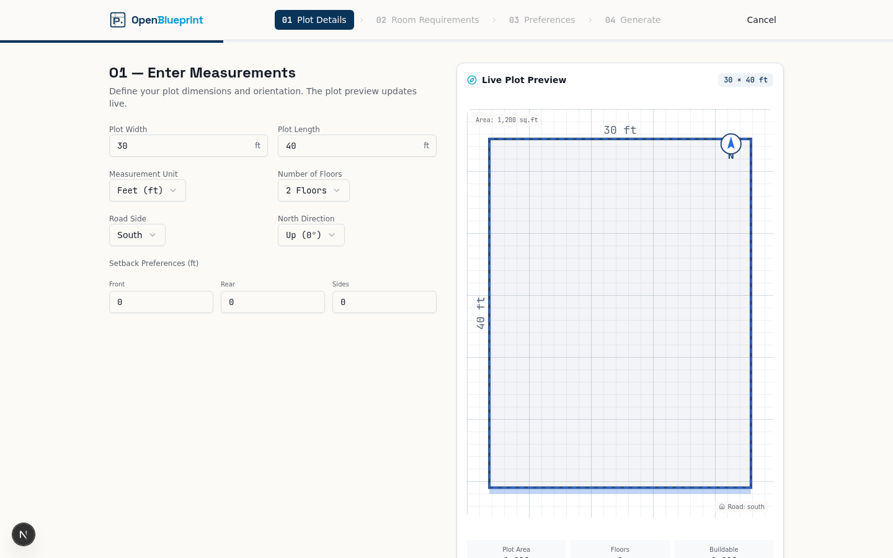
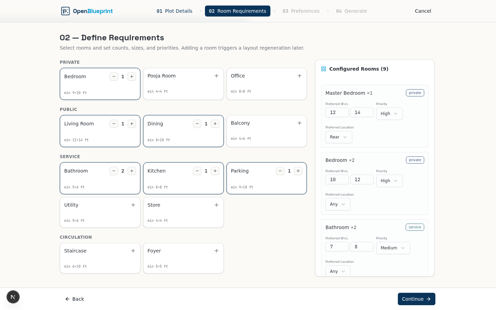

# OpenBlueprint

### From Measurements to Intelligent Blueprints.

**OpenBlueprint** is an AI-powered architectural planning and preliminary blueprint generation platform for homes and small construction projects. Enter your plot dimensions, define your requirements, and generate editable preliminary floor plans in minutes — with 2D editing, 3D visualization, cost estimation, and an AI design assistant.



---

## Features

### AI-Assisted Planning
Turn natural-language requirements into structured design constraints. The AI assistant understands Indian residential architecture, Vastu preferences, and architectural rules (zone clustering, adjacency, privacy gradient).

### Smart Blueprint Generation
Generate **5 design strategies** — Space Optimized, Ventilation Optimized, Modern Open, Privacy Optimized, and Vastu Compliant — using a zone-based BSP layout engine that tiles rooms with zero wasted space.



### Interactive 2D Editor
Drag, resize, and customize rooms with a full CAD-like toolset:
- **Room tool** — move, resize, split (zig-zag), change floors, auto-arrange
- **Door tool** — add doors on any wall, adjust position, set swing direction (In-Left, In-Right, Out-Left, Out-Right)
- **Window tool** — add/edit windows with position sliders
- **Furniture tool** — drag from a 45+ item library, rotate, resize, recolor



### Furniture Library
45+ furniture items across 9 categories (Bedroom, Living, Dining, Kitchen, Bathroom, Office, Storage, Decor, Commercial) — all draggable, rotatable, resizable, and deletable.



### 3D Visualization
Explore your design in an interactive 3D environment with:
- Realistic clay-render style with black edge outlines
- Semi-transparent walls (cutaway view) so furniture is visible inside
- Animated 3D car and bike models in parking
- Camera presets: Orbit, Isometric, Front, Top
- Floor selector and multi-floor stacking



### Cost Estimation
Get a preliminary construction cost estimate in INR with:
- 4 construction grades (Basic, Standard, Premium, Luxury)
- Full cost breakdown (Foundation, Structure, Flooring, Electrical, Plumbing, etc.)
- Live updates when area or materials change



### AI Design Assistant
Ask the AI to modify your design in natural language:
- "Make the kitchen larger"
- "Add a balcony"
- "Move master bedroom to SW"
- "Create a more open layout"

The AI interprets the request, applies structured changes, and updates the layout instantly.

### Human-in-the-Loop Floor Distribution
For multi-floor buildings, confirm which rooms go on which floor before generation — preventing layout misconceptions.



### RAG Knowledge Assistant
Ask contextual architectural questions and get answers from a curated knowledge base covering room planning, kitchen layout, construction costs, Vastu, setbacks, and more.

### Export & Share
Export your design as PDF (full blueprint sheet), PNG, SVG, or Project JSON. Generate shareable links.

---

## Architectural Rules Engine

OpenBlueprint enforces **8 non-negotiable architectural rules**:

1. **Zone Clustering** — Public (living, dining, kitchen) at front; Private (bedrooms, bathrooms) at rear; Service (parking, utility) at side
2. **Adjacency Requirements** — Kitchen must be adjacent to dining/living; bathrooms near bedrooms; garage not adjacent to bedrooms
3. **Circulation** — Direct paths: entry → public → private; no cut-through traffic
4. **Kitchen Work Triangle** — Sink, cooktop, refrigerator form a triangle (12–22 ft perimeter)
5. **Privacy Gradient** — Most public → most private, front to rear
6. **Minimum Code Standards** — Habitable rooms ≥ 80 sq.ft; at least one room ≥ 102 sq.ft
7. **Prohibited Mistakes** — No garage-without-foyer, no isolated kitchen, no bathroom-off-living, no bedroom-as-passage
8. **Output Validation** — Reports which constraints passed/failed

---

## Technology Stack

| Layer | Technology |
|-------|-----------|
| Framework | Next.js 16 (App Router) |
| Language | TypeScript 5 |
| Styling | Tailwind CSS 4 + shadcn/ui |
| 3D | Three.js + React Three Fiber + Drei |
| State | Zustand + TanStack Query |
| Database | Prisma ORM (SQLite) |
| AI | z-ai-web-dev-sdk (LLM + Vision) |
| Animations | Framer Motion |
| Icons | Lucide React |

---

## Getting Started

### Prerequisites
- Node.js 18+ or Bun
- npm/bun package manager

### Installation

```bash
# Clone the repository
git clone https://github.com/Somesh4206/OpenBlueprint.git
cd OpenBlueprint

# Install dependencies
bun install

# Set up the database
bun run db:push

# Start the development server
bun run dev
```

The app will be available at `http://localhost:3000`.

### Build for Production

```bash
bun run build
bun run start
```

---

## Usage

1. **Create a Blueprint** — Click "Create Blueprint" on the landing page
2. **Enter Plot Details** — Set plot width, length, road side, floors, setbacks
3. **Define Requirements** — Select rooms (bedrooms, bathrooms, kitchen, etc.) with counts and sizes
4. **Set Preferences** — Choose architecture style, spatial preferences, optional Vastu
5. **Confirm Floor Distribution** — For multi-floor, review and adjust room placement per floor
6. **Choose a Design** — Select from 5 AI-generated design strategies
7. **Edit in 2D** — Use tools to move/resize rooms, add doors/windows, drag furniture
8. **Visualize in 3D** — Switch to 3D view, rotate, zoom, explore
9. **Estimate Cost** — Check the preliminary cost estimate
10. **Ask AI** — Use the AI assistant to modify the design
11. **Export** — Download as PDF, PNG, SVG, or JSON

---

## Project Structure

```
src/
├── app/                          # Next.js App Router
│   ├── api/                      # API routes
│   │   ├── projects/             # Project CRUD
│   │   ├── layout/               # Layout generate + validate
│   │   ├── ai/                    # AI design assistant + knowledge
│   │   ├── cost/                  # Cost estimation
│   │   └── export/                # PDF/PNG/SVG export
│   ├── page.tsx                  # View router
│   └── layout.tsx                # Root layout
├── lib/
│   ├── types.ts                  # Type system (single source of truth)
│   ├── store.ts                  # Zustand global state
│   ├── room-catalog.ts           # 13 room types with dimensions
│   ├── furniture-catalog.ts      # 45+ furniture items
│   ├── indian-architecture.ts    # Indian architecture knowledge base
│   ├── svg-renderer.ts           # Server-side SVG blueprint renderer
│   ├── layout/
│   │   ├── engine.ts             # Zone-based BSP layout engine
│   │   ├── scoring.ts            # 6-axis design scoring
│   │   └── validation.ts         # Architecture rules validation
│   ├── architecture/
│   │   ├── rules.ts              # 8 non-negotiable architectural rules
│   │   └── planner.ts            # Zone-based placement planner
│   ├── ai/
│   │   ├── design-assistant.ts   # LLM-powered AI assistant
│   │   ├── apply-actions.ts      # Action application + insights
│   │   └── knowledge-base.ts     # RAG knowledge base
│   └── cost/
│       └── estimator.ts          # INR cost estimation
├── components/
│   └── openblueprint/
│       ├── landing/              # Landing page
│       ├── dashboard/            # Project dashboard
│       ├── wizard/               # 4-step project setup wizard
│       ├── design-options/       # Design strategy selection
│       └── workspace/            # Full-screen blueprint editor
│           ├── blueprint-canvas.tsx   # Interactive 2D SVG canvas
│           ├── viewer-3d.tsx          # React Three Fiber 3D viewer
│           ├── furniture-3d.tsx       # 3D furniture models
│           ├── furniture-symbol.tsx  # 2D furniture SVG symbols
│           ├── tool-panel.tsx         # Contextual tool panel
│           ├── ai-assistant.tsx       # AI chat panel
│           ├── panels.tsx            # Validation/analysis panels
│           └── export-modal.tsx      # Export dialog
```

---

## Screenshots

| Landing Page | Dashboard |
|:---:|:---:|
|  |  |

| Wizard — Plot Details | Wizard — Room Requirements |
|:---:|:---:|
|  |  |

| Design Options | Floor Distribution |
|:---:|:---:|
|  |  |

| 2D Blueprint Editor | 3D Visualization |
|:---:|:---:|
|  |  |

| Furniture Editing | Cost Estimator |
|:---:|:---:|
|  |  |

---

## Disclaimer

OpenBlueprint provides AI-assisted conceptual planning and preliminary design visualization. Generated layouts are **not** a substitute for professional architectural, structural, electrical, plumbing, or regulatory drawings. Consult qualified professionals and verify applicable local regulations before construction.

---

## License

MIT

---

## Acknowledgments

- Built with [Next.js](https://nextjs.org), [React Three Fiber](https://docs.pmnd.rs/react-three-fiber), [shadcn/ui](https://ui.shadcn.com), [Tailwind CSS](https://tailwindcss.com)
- AI powered by [z-ai-web-dev-sdk](https://www.npmjs.com/package/z-ai-web-dev-sdk)
- Architectural rules inspired by Indian residential building codes and Vastu Shastra principles
